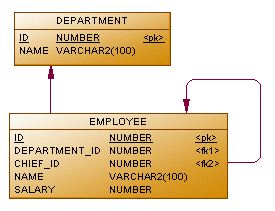

### Тестовое задание для курса "Школа инженера"

#### Задание 1
Дана БД, имеющая  две таблицы: сотрудники и подразделение.
Необходимо написать 4 запроса.

1. Сотрудника с максимальной заработной платой:

***SELECT name FROM employee
   WHERE salary = (SELECT MAX(SALARY) FROM employee)***
1.  
1. Отдел с максимальной суммарной зарплатой сотрудников:

***WITH salary_sum AS (SELECT department_id, SUM(salary) AS salary
   FROM employee GROUP BY department_id) SELECT department_id FROM salary_sum WHERE salary_sum.salary = (SELECT MAX(salary)
   FROM salary_sum)***
1. Сотрудника, чье имя начинается на «Р» и заканчивается на «н»:

***SELECT name FROM employee WHERE name LIKE "Р%н"***

#### Задание 2
[Консольное приложение для подсчёта частотности слов](/3%20Test%20items/Digital%20Design/Program.cs)
